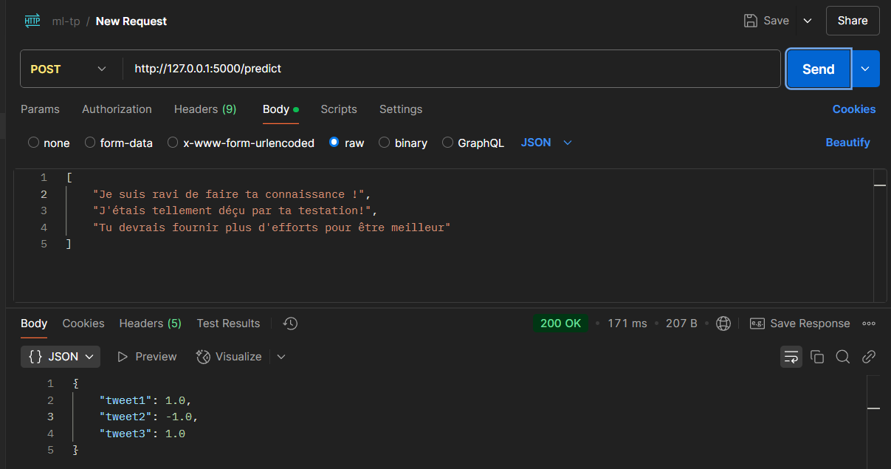

## 👤 Collaborateurs
- Rosvalde Florient MANFO JIENGAP
- Ranyl Josue FOUMBI DJOMO

## 🏗️ Description du projet

Ce projet, réalisé dans le cadre du module d'algorithmie avancée, repose sur la conception et l'analyse de modèles de machine learning supposés prédire le caractère positif ou négatif des tweets en s'appuyant sur le principe de régression logistique.

## 📂 Structure du projet

Le projet comprend :
- Un script d'initialisation de la base de données d'entraînement des modèles (positif et négatif) `init_db.py`
- Un script de lancement de l'API Flask d'envoi de tweets `main.py`
- Un script pour afficher les matrices de confusion `print_confusion_matrix.py`

## 🚀 Installation et Lancement
### Prérequis 
- Avoir MySQL installé sur son ordinateur ou Docker pour l'installation d'une image MySQL

### Étapes d'exécution
Pour exécuter le projet, il vous suffit de suivre les étapes suivantes :
- Cloner le projet via le lien `https://github.com/RanylFoumbi/ml-tweet.git`
- Créer un environnement virtuel à la racine du projet `python -m venv .venv`
- Activer l'environnement virtuel `./.venv/Scripts/Activate.ps1`
- Modifier le fichier `.env` à la racine du projet pour l'adapter à votre environnement d'exécution. Il s'agit des variables relatives à MYSQL (`MYSQL_ROOT_USER`, `MYSQL_ROOT_PASSWORD`, `MYSQL_PORT`)
- Installer tous les modules Python se trouvant dans le fichier `requirements.txt` à l'aide de la commande `pip install -r requirements.txt`
- Une fois le service MySQL en cours d'exécution, exécutez le script `init_db.py` pour l'initialisation de la base de données
- Exécuter le script `main.py` pour démarrer l'API. Ce script entraînera également le modèle avant de démarrer l'API Flask
- Pour planifier le réentraînement, exécutez le script `run_cronjob.py` et le modèle sera réentraîné chaque semaine à l'heure d'exécution du script
- Pour lancer les tests et afficher les matrices de confusion, exécutez le script `print_confusion_matrix.py`
 

## ➕ NB:
Nous avons inclus dans le projet un Dockerfile que vous pouvez exploiter si vous ne désirez pas installer MySQL et que vous disposez de Docker sur votre ordinateur.

Le fichier contenant le rapport d'évaluation est le suivant `Rapport d'évaluation.pdf`